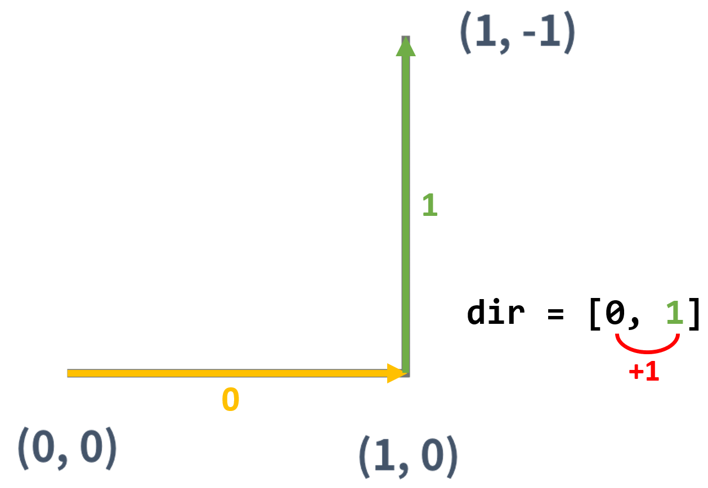
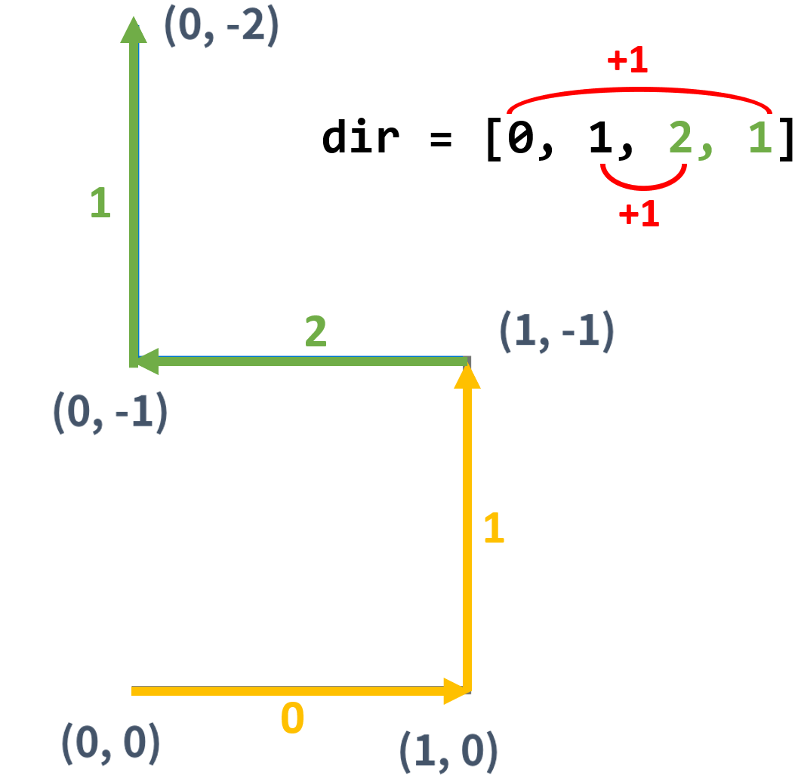
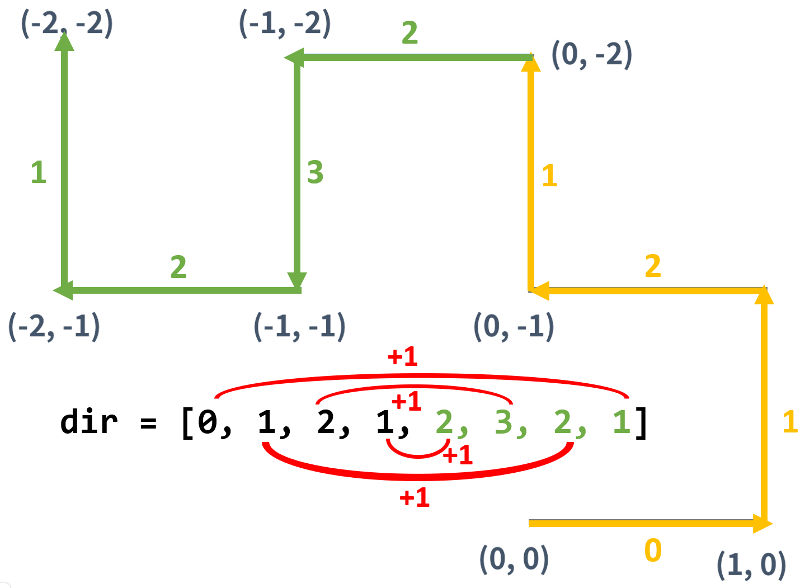

# [ 15685 ] 드래곤 커브

Created: Apr 09, 2020 12:28 AM
Tags: 3rd week, Baekjoon
URL: https://www.acmicpc.net/problem/15685

### 전체 코드

    #include <iostream>
    #include <vector>
    #include <utility>
    
    #define SIZE 101
    
    using namespace std;
    
    bool map[SIZE][SIZE] = {false, };
    
    class DragonCurve{
    private:
    	int x;
    	int y;
    	int d;
    	int g;
    	vector<int> dir;
    	vector<pair<int, int>> pos;
    
    	// draw a line started from (x_, y_) in d_ direciton
    	void draw_line(int& x_, int& y_, int d_){
    		int dx[4] = {1, 0, -1, 0}; // →, ↑, ←, ↓
    		int dy[4] = {0, -1, 0, 1}; // →, ↑, ←, ↓
    		int next_x = x_ + dx[d_];
    		int next_y = y_ + dy[d_];
    
    		map[next_y][next_x] = true;
    		dir.push_back(d_);
    		pos.push_back(make_pair(next_x, next_y));
    		x_ = next_x;
    		y_ = next_y;
    	}
    public:
    	void init(int x_, int y_, int d_, int g_){
    		x = x_;
    		y = y_;
    		d = d_;
    		g = g_;
    		dir.clear();
    		pos.clear();
    	}
    	void draw_nth_curve(int n){
    		if(n == 0){
    			map[y][x] = true;
    			pos.push_back(make_pair(x, y));
    			draw_line(x, y, d);
    		}
    		else{
    			int size = dir.size();
    			int new_x = pos.back().first, new_y = pos.back().second, new_dir;
    			for(int i=size-1; i>=0; i--){
    				new_dir = (dir[i] + 1) % 4;
    				draw_line(new_x, new_y, new_dir);
    			}
    		}
    		if(n < g){
    			draw_nth_curve(n+1);
    		}
    	}
    
    };
    
    int count(){
    	int cnt = 0;
    	for(int i=0; i<SIZE-1; i++){
    		for(int j=0; j<SIZE-1; j++){
    			if(map[i][j] && map[i+1][j] && map[i][j+1] && map[i+1][j+1]){
    				cnt++;
    			}
    		}
    	}
    	return cnt;
    }
    
    int main(){
    	int x, y, d, g, N;
    	DragonCurve dc = DragonCurve();
    
    	cin >> N;
    	for(int i=0; i<N; i++){
    		cin >> x >> y >> d >> g;
    		dc.init(x, y, d, g);
    		dc.draw_nth_curve(0);
    	}
    	cout << count() << '\n';
    }

### 코드 설명

n세대의 드래곤 커브는 (n-1)세대의 드래곤 커브를 이용해 만든다. 따라서 다음과 같이 재귀함수로 g세대 드래곤 커브를 구현할 수 있다. 

    void draw_nth_curve(int n){
    	// draw n-th dragon curve
    	do_something();
    
    	if(n < g){
    		draw_nth_curve(n+1);
    	}
    }

우선 델타 배열을 →, ↑, ←, ↓ 순서대로 선언하면, `dx[i]`와 `dy[i]`는 `i` 방향으로 이동했을 때를 나타낸다.

    int dx[4] = {1, 0, -1, 0}; // →, ↑, ←, ↓
    int dy[4] = {0, -1, 0, 1}; // →, ↑, ←, ↓

드래곤 커브는 세대를 거듭할 때 이전 세대의 커브의 끝 점에서 시계방향으로 90도 회전한다. 이를 방향의 관점에서 생각해보면 다음과 같은 규칙을 갖는다.

- 1세대

- 2세대

- 3세대

즉, 이전 세대 선들을 역순서대로 원래 방향의 +1해서 선을 이어나가면 된다. 이를 코드로 나타내면 다음과 같다.

    int size = dir.size();
    int new_x = pos.back().first, new_y = pos.back().second, new_dir;
    for(int i=size-1; i>=0; i--){
    	new_dir = (dir[i] + 1) % 4;
    	draw_line(new_x, new_y, new_dir);
    }

`draw_line()`은 인자로 받은 `x_`, `y_` 위치에서 `d_` 방향으로 선을 긋는 함수이다. 선이 그어진 끝지점은 `map` 값을 true로 나타내기로 한다.

    // draw a line started from (x_, y_) in d_ direciton
    void draw_line(int& x_, int& y_, int d_){
    	int dx[4] = {1, 0, -1, 0}; // →, ↑, ←, ↓
    	int dy[4] = {0, -1, 0, 1}; // →, ↑, ←, ↓
    	int next_x = x_ + dx[d_];
    	int next_y = y_ + dy[d_];
    	
    	map[next_y][next_x] = true;
    	dir.push_back(d_);
    	pos.push_back(make_pair(next_x, next_y));
    	x_ = next_x;
    	y_ = next_y;
    }