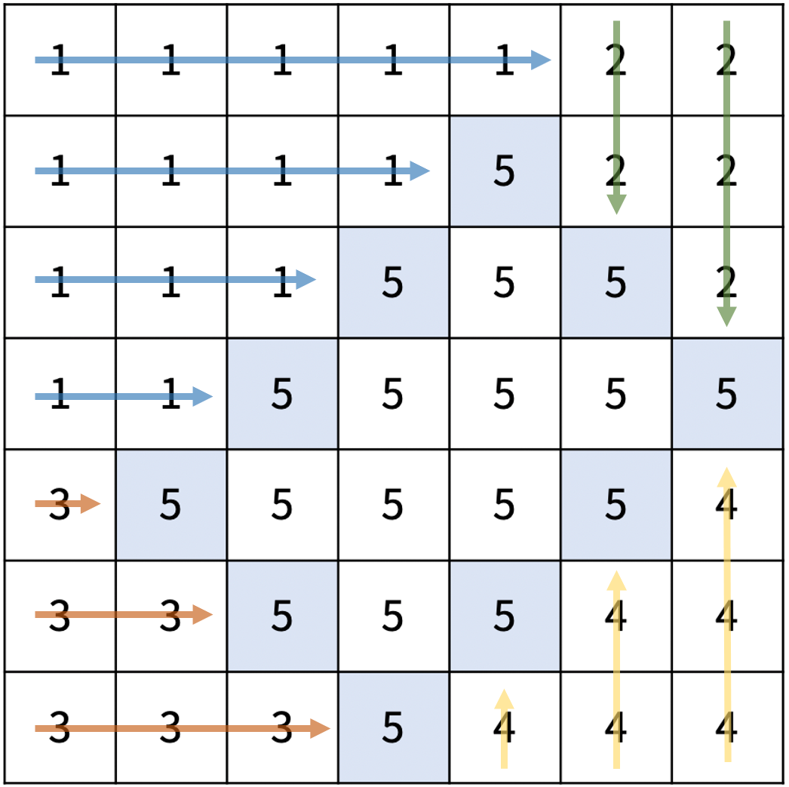

# [ 17779 ] 게리맨더링 2

Created: Apr 19, 2020 4:37 PM
Tags: 4th week, Baekjoon
URL: https://www.acmicpc.net/problem/17779

### 전체 코드

    #include <iostream>
    #include <climits>
    
    #define MAX_SIZE 20
    
    using namespace std;
    
    int N;
    int total_sum = 0;
    int city[MAX_SIZE][MAX_SIZE];
    
    int gerrymandering(int x, int y, int d1, int d2){
    	bool boundary[MAX_SIZE][MAX_SIZE] = {false, };
    	int sum[6] = {0, };
    	int max_pop = INT_MIN, min_pop = INT_MAX;
    	// margin
    	for(int i=0; i<=d1; i++){
    		boundary[x+i][y-i] = true;
    		boundary[x+d2+i][y+d2-i] = true;
    	}
    	for(int i=0; i<=d2; i++){
    		boundary[x+i][y+i] = true;
    		boundary[x+d1+i][y-d1+i] = true;
    	}
    	// region #1
    	for(int r=0; r<x+d1; r++){
    		for(int c=0; c<=y; c++){
    			if(boundary[r][c]) break;
    			sum[1] += city[r][c];
    		}
    	}
    	// region #2
    	for(int c=y+1; c<=N-1; c++){
    		for(int r=0; r<=x+d2; r++){
    			if(boundary[r][c]) break;
    			sum[2] += city[r][c];
    		}
    	}
    	// region #3
    	for(int r=x+d1; r<=N-1; r++){
    		for(int c=0; c<y-d1+d2; c++){
    			if(boundary[r][c]) break;
    			sum[3] += city[r][c];
    		}
    	}
    	// region #4
    	for(int c=y-d1+d2; c<=N-1; c++){
    		for(int r=N-1; r>=x+d2+1; r--){
    			if(boundary[r][c]) break;
    			sum[4] += city[r][c];
    		}
    	}
    	sum[5] = total_sum - (sum[1]+sum[2]+sum[3]+sum[4]);
    	for(int i=1; i<=5; i++){
    		max_pop = max(max_pop, sum[i]);
    		min_pop = min(min_pop, sum[i]);
    	}
    	return (max_pop-min_pop);
    }
    
    int min_diff(){
    	int ret = INT_MAX;
    
    	for(int x=0; x<=N-3; x++){
    		for(int y=1; y<=N-2; y++){
    			// For the given (x, y), determine d1 and d2
    			for(int d1=1; d1<=y; d1++){
    				for(int d2=1; d2<=N-1-y; d2++){
    					if(x+d1+d2 <= N-1){ // valid
    						ret = min(gerrymandering(x, y, d1, d2), ret);
    					}
    				}
    			}
    		}
    	}
    	return ret;
    }
    
    int main(){
    	cin >> N;
    	for(int i=0; i<N; i++){
    		for(int j=0; j<N; j++){
    			cin >> city[i][j];
    			total_sum += city[i][j];
    		}
    	}
    	cout << min_diff();
    }

### 코드 설명

모든 기준점 (x, y)에서 가능한 모든 d1, d2에 대해 선거구를 나누어 계산했다. x, y, d1, d2가 정해졌을 때 선거구를 나누고, 인구 차를 계산하는 함수 `gerrymandering()`은 다음과 같이 실행된다.

1. 선거구 5의 경계선에 위치한 구역을 `boundary` 배열에 true로 표시한다.
2. 경계선에 따라 선거구 1, 2, 3, 4의 인구 합을 각각 계산한다.

3. 인구가 가장 많은 선거구의 인구 수 `max_pop`과 가장 적은 선거구의 인구 수 `min_pop`을 구하고, 이 둘의 차를 반환한다.